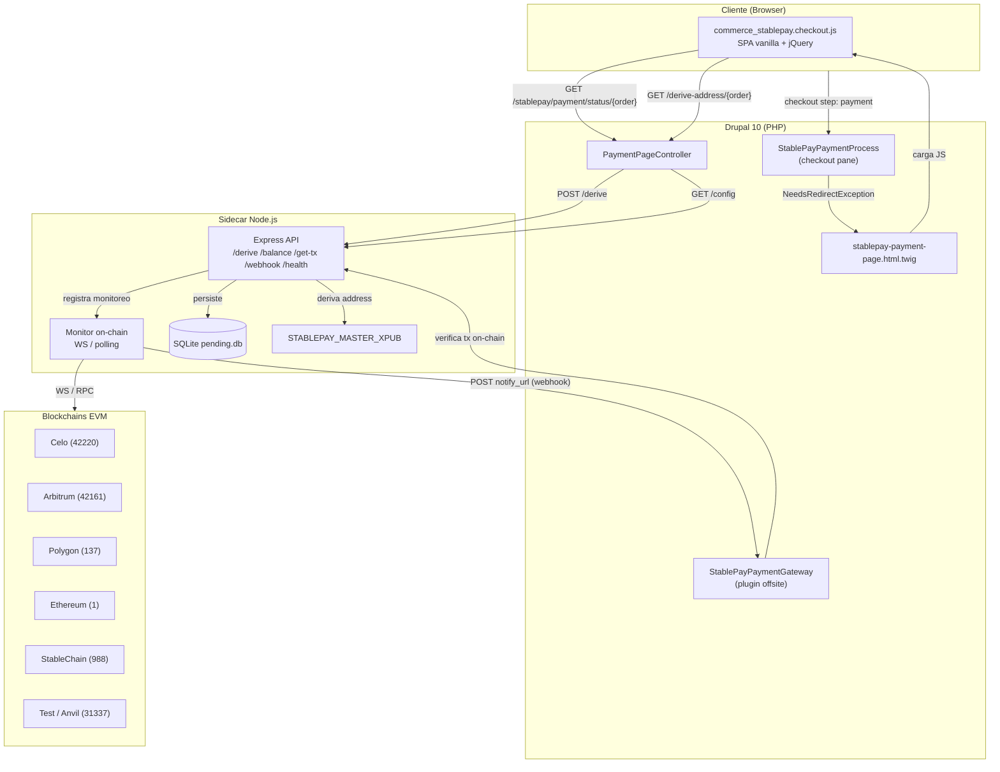
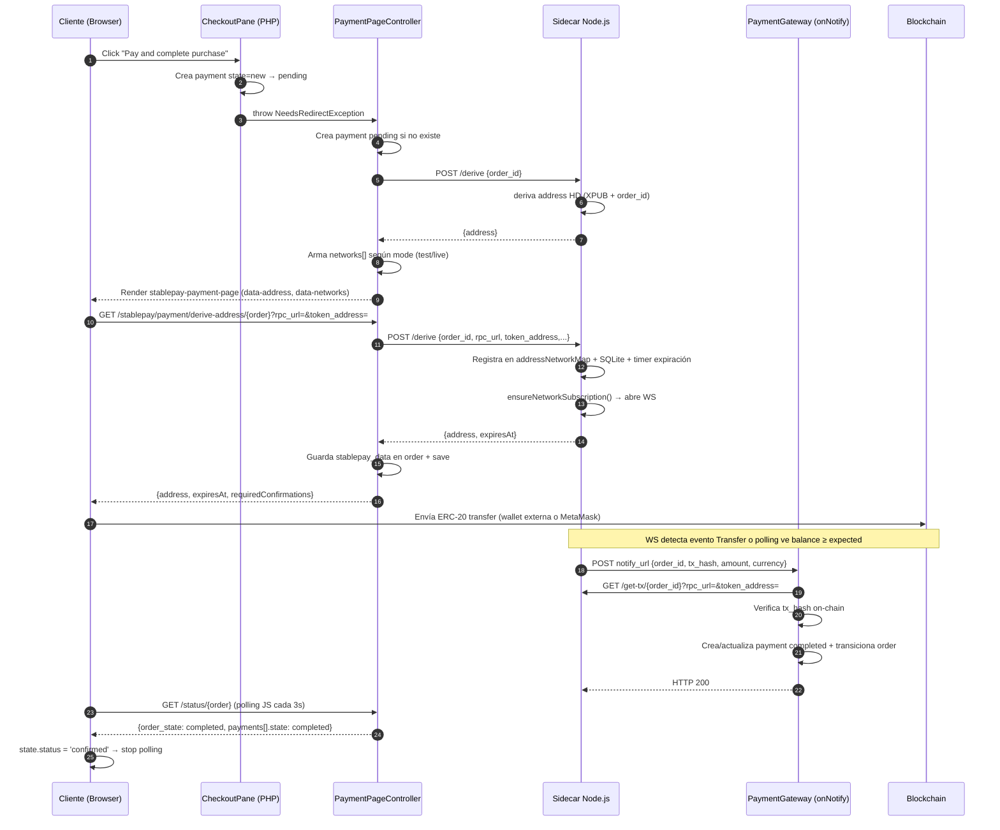
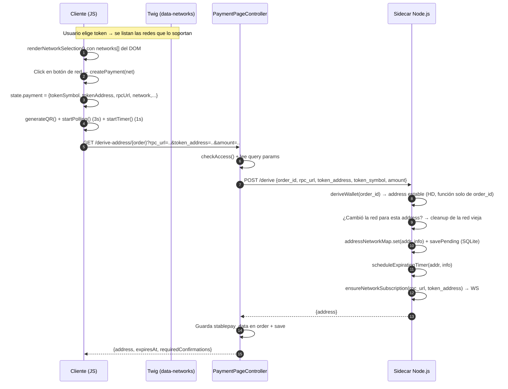
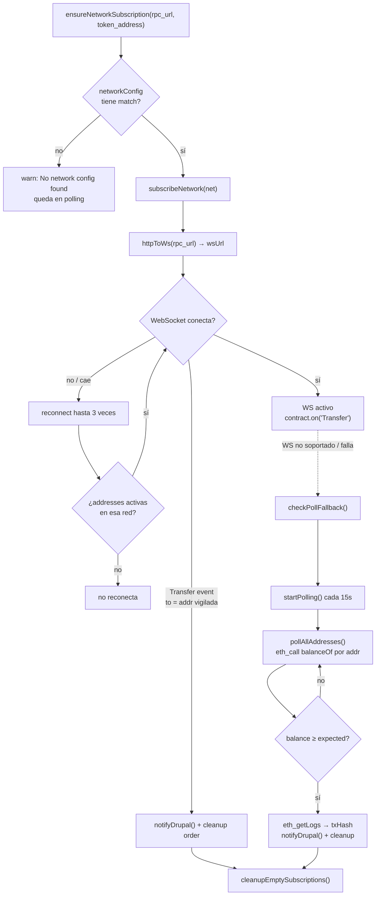
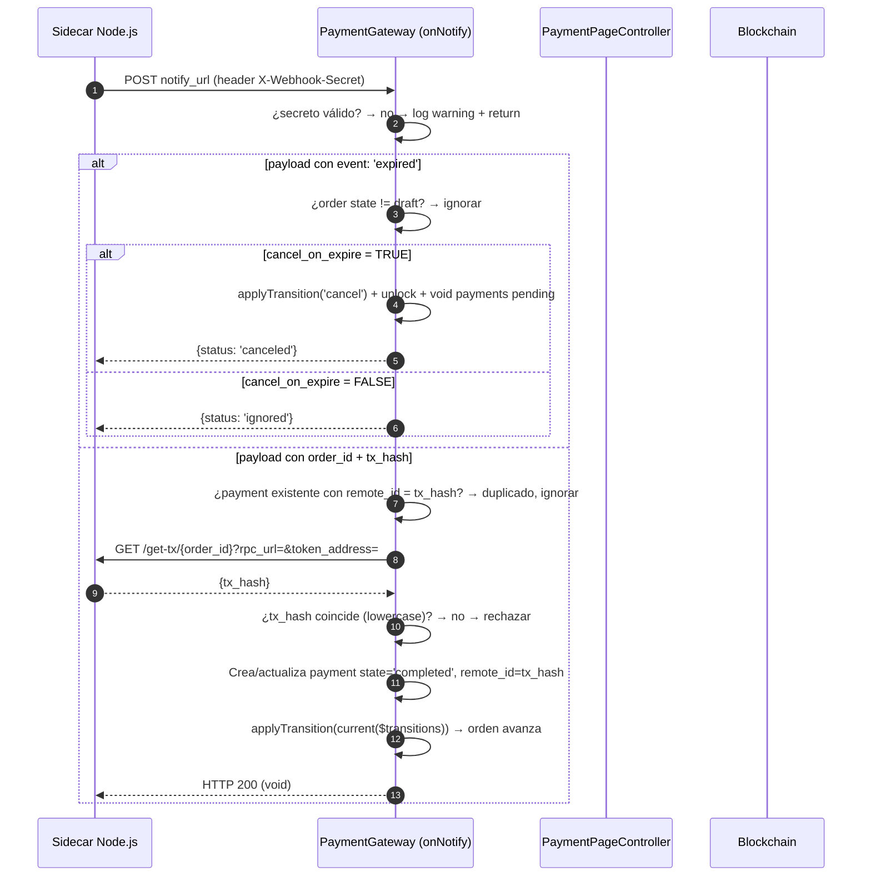
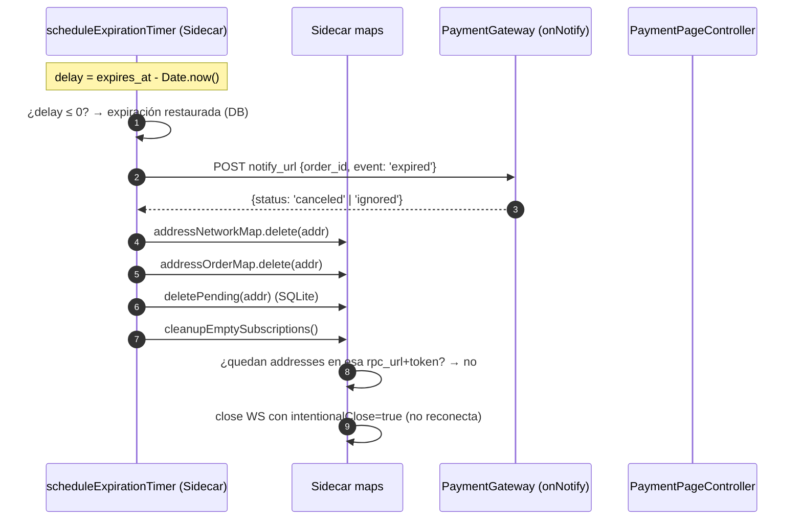
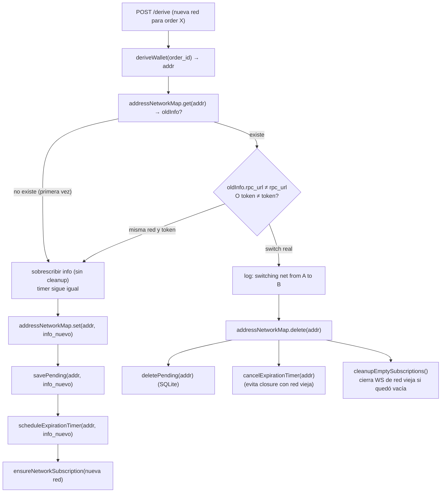
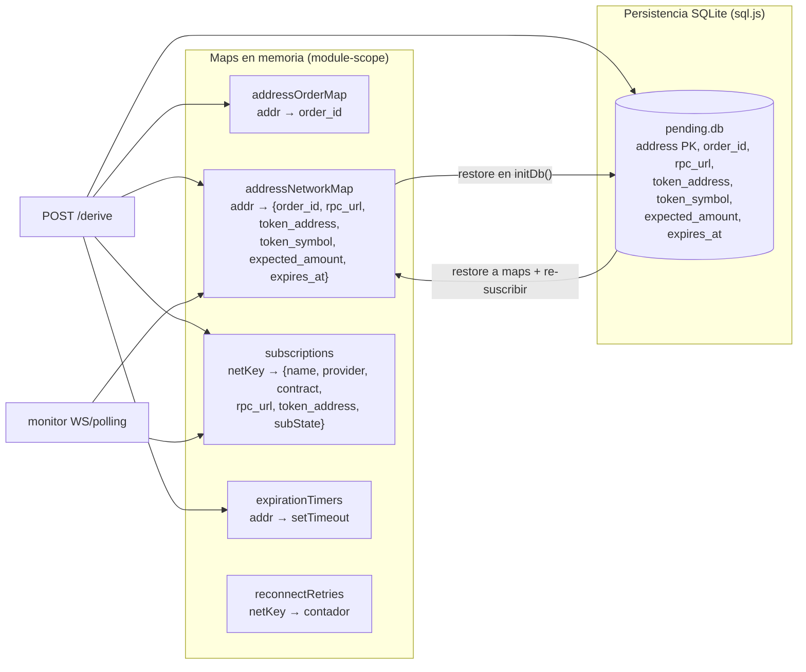
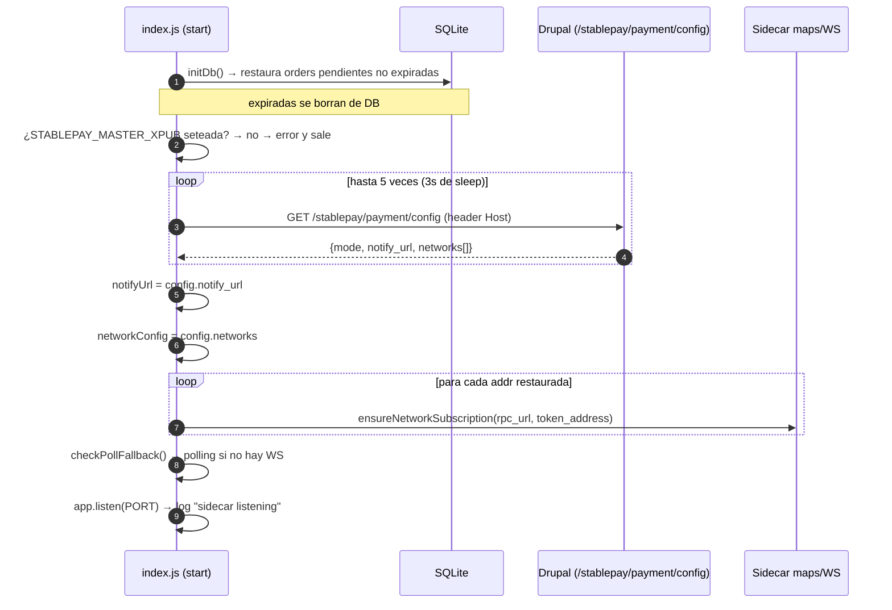

# Arquitectura — StablePay (commerce_stablepay)

Gateway de pago cripto off-site para Drupal Commerce. Permite pagar con **USDC/USDT** en varias redes EVM (StableChain, Celo, Arbitrum, Polygon, Ethereum) usando una **HD Wallet en modo XPUB (watch-only)** y un **sidecar Node.js** que monitorea la blockchain (WebSocket con fallback a polling HTTP) y notifica a Drupal cuando se detecta el pago.

---

## 1. Arquitectura general

---

## 2. Flujo de checkout completo (end-to-end)

---

## 3. Selección de red y derivación de address

---

## 4. Monitoreo on-chain (WebSocket vs Polling fallback)

---

## 5. Notificación y confirmación de pago (onNotify)

---

## 6. Expiración y cleanup

---

## 7. Switch de red (misma order, sin expirar)

---

## 8. Estado del sidecar (state maps + persistencia)

---

## 9. Startup del sidecar

---

## 10. Tabla de endpoints

### Rutas Drupal (commerce_stablepay.routing.yml)

| Route | Path | Controller::method | Requisito | Propósito |
|---|---|---|---|---|
| `payment_page` | `/stablepay/payment/{order}` | `PaymentPageController::build` | `access checkout` + custom access | Render de la página de pago |
| `status` | `/stablepay/payment/status/{order}` | `PaymentPageController::status` | `access checkout` | Polling JS (3s): estado order + balance on-chain + auto-confirm |
| `config` | `/stablepay/payment/config` | `PaymentPageController::gatewayConfig` | público (`TRUE`) | Sidecar obtiene networks/notify_url al arrancar |
| `derive` | `/stablepay/payment/derive-address/{order}` | `PaymentPageController::deriveAddress` | `access checkout` | Registra monitoreo de red+token en sidecar |
| `gas_price` | `/stablepay/payment/gas-price` | `PaymentPageController::gasPrice` | público (`TRUE`) | Precio USD del token nativo por red (CoinGecko, cache 5min por `coin`) para el fee estimado |
| `gas_estimate` | `/stablepay/payment/gas-estimate` | `PaymentPageController::gasEstimate` | público (`TRUE`) | Proxy: JS → Drupal → sidecar `/gas-estimate` |

### Endpoints Sidecar (Express, puerto 3001)

| Método | Ruta | Params | Respuesta |
|---|---|---|---|
| `POST` | `/derive` | `{order_id, rpc_url?, token_address?, token_symbol?, expected_amount?, expiration_minutes?}` | `{address}` |
| `GET` | `/balance/:orderId` | query `rpc_url, token_address, token_symbol?, expected_amount?` | `{balance, expected, token_symbol, found}` |
| `GET` | `/get-tx/:orderId` | query `rpc_url, token_address` | `{tx_hash, address}` |
| `GET` | `/gas-estimate` | query `rpc_url, token_address, to?, amount?, decimals?` | `{gas_limit, gas_price, cost_native, cost_wei}` |
| `POST` | `/webhook` | `{order_id, tx_hash, amount, currency}` | `{status: 'ok'}` (testing) |
| `GET` | `/health` | — | `{status, xpub, ws, polling, subscriptions, addresses, networks}` |

### Webhook de notificación

| Método | URL | Origen |
|---|---|---|
| `POST` | `/payment/notify/{gateway}` (commerce_payment.notify) | Sidecar (`getNotifyUrl()`) con header `X-Webhook-Secret` |

---

## 11. Redes soportadas

| Red | chainId | Token | Contract address | RPC default | Gating |
|---|---|---|---|---|---|
| Test (Anvil) | 31337 | configurable | `getTestTokenAddress()` | `http://host.docker.internal:8545` | `mode = test` |
| StableChain | 988 | USDT | `0x779Ded0c9e1022225f8E0630b35a9b54bE713736` | `https://rpc.stable.xyz` | `mode = live` |
| Celo | 42220 | USDC | `0xcebA9300f2b948710d2653dD7B07f33A8B32118C` | `https://forno.celo.org` | `mode = live` |
| Celo | 42220 | USDT | `0x48065fbbe25f71c9282ddf5e1cd6d6a887483d5e` | `https://forno.celo.org` | `mode = live` |
| Arbitrum | 42161 | USDC | `0xaf88d065e77c8cC2239327C5EDb3A432268e5831` | `https://arbitrum.drpc.org` | `mode = live` |
| Arbitrum | 42161 | USDT | `0xFd086bC7CD5C481DCC9C85ebE478A1C0b69FCbb9` | `https://arbitrum.drpc.org` | `mode = live` |
| Polygon | 137 | USDC | `0x3c499c542cEF5E3811e1192ce70d8cC03d5c3359` | `https://polygon-rpc.com` | `mode = live` |
| Polygon | 137 | USDT | `0xc2132D05D31c914a87C6611C10748AEb04B58e8F` | `https://polygon-rpc.com` | `mode = live` |
| Ethereum | 1 | USDC | `0xa0b86991c6218b36c1d19d4a2e9eb0ce3606eb48` | `https://ethereum.drpc.org` | `mode = live` |
| Ethereum | 1 | USDT | `0xdAC17F958D2ee523a2206206994597C13D831ec7` | `https://ethereum.drpc.org` | `mode = live` |

> Nota: los RPC default de Polygon/Arbitrum/Ethereum pueden requerir un endpoint con API key. El sidecar solo carga `networkConfig` al arrancar (`/config`) — **cambios en la UI del gateway requieren reiniciar el sidecar**.

---

## 12. Configuración clave

| Clave | Default | Descripción |
|---|---|---|
| `mode` | `test` | Test (Anvil) o Live (redes reales) |
| `expiration_minutes` | `30` | Minutos antes de que expire la order |
| `confirmation_blocks` | `1` | Confirmaciones requeridas |
| `cancel_on_expire` | `FALSE` | Cancelar la order al expirar el pago |
| `fiat_currency` | `PYG` | Moneda fiat del store (para conversión a USD) |
| `sweep_address` | `''` | Address master para sweep (herramienta externa) |

### Variables de entorno del sidecar

| Variable | Default | Uso |
|---|---|---|
| `PORT` | `3001` | Puerto HTTP del sidecar |
| `DRUPAL_BASE_URL` | `http://nginx` | URL base de Drupal |
| `DRUPAL_HOST` | `store.localhost` | Header `Host` al llamar a Drupal |
| `STABLEPAY_MASTER_XPUB` | `''` | XPUB de la HD wallet (watch-only) |
| `STABLEPAY_DB_PATH` | `./pending.db` | Ruta del SQLite de pendientes |
| `WEBHOOK_SECRET` | `''` | Secreto para `X-Webhook-Secret` |

---

## 13. Glosario

| Término | Significado |
|---|---|
| **XPUB** | Clave pública extendida de una HD wallet. Permite derivar direcciones sin conocer la clave privada (watch-only). |
| **HD wallet / BIP-44** | Wallet determinista jerárquica. Las direcciones se derivan de un índice. Aquí el índice = derivado del `order_id`. |
| **ERC-20 Transfer event** | Evento log de los tokens ERC-20 con topic `0xddf252ad...`. El sidecar lo escucha por WebSocket para detectar pagos. |
| **EIP-681** | Esquema de URI `ethereum:token@chainId/transfer?address=..&uint256=..` para QR de pago. |
| **eth_call** | RPC JSON para leer estado de un contrato (balanceOf, decimals) sin minar. |
| **eth_getLogs** | RPC JSON para leer logs históricos (usado para obtener txHash tras detectar balance). |
| **NeedsRedirectException** | Excepción de Drupal Commerce que redirige el checkout a otra URL (la página de pago). |
| **Polling fallback** | Si WebSocket no está disponible, el sidecar consulta `balanceOf` cada 15s. |
| **Cleanup per-red** | Cierre selectivo de WebSockets: solo se cierra el WS de una red cuando no quedan addresses vigiladas en esa `rpc_url`+`token_address`. |
